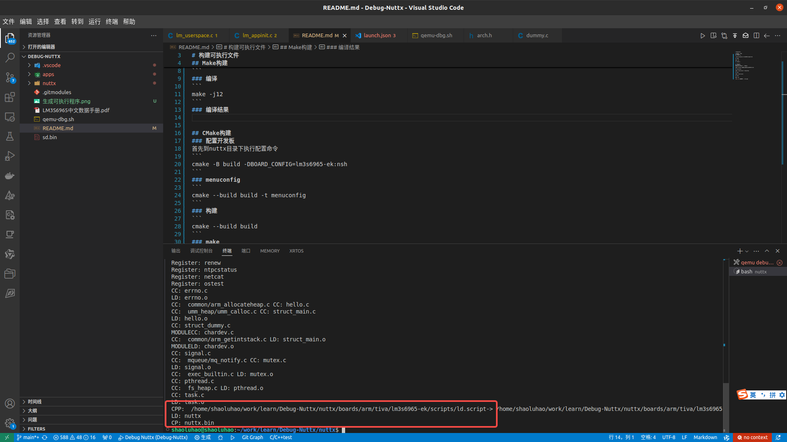
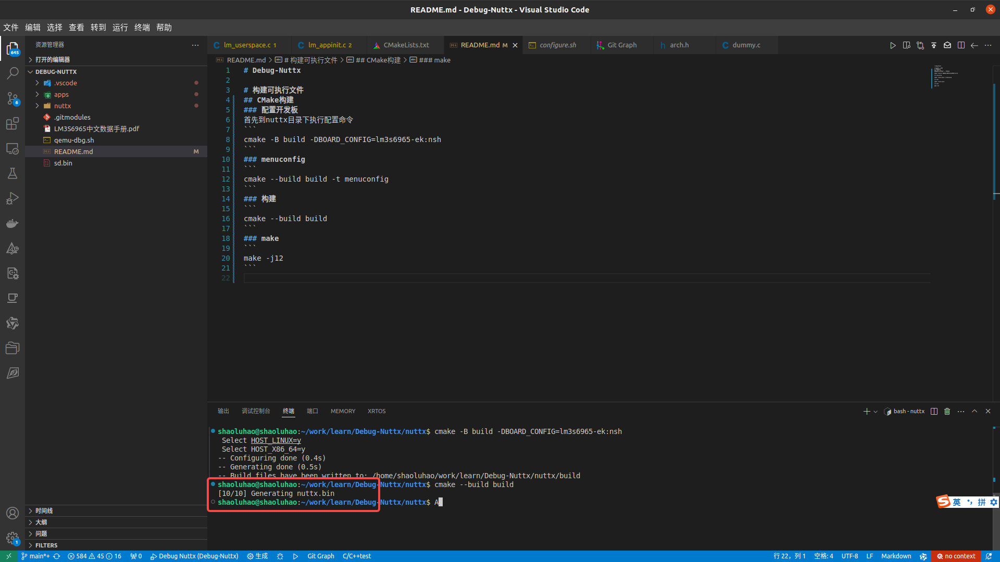
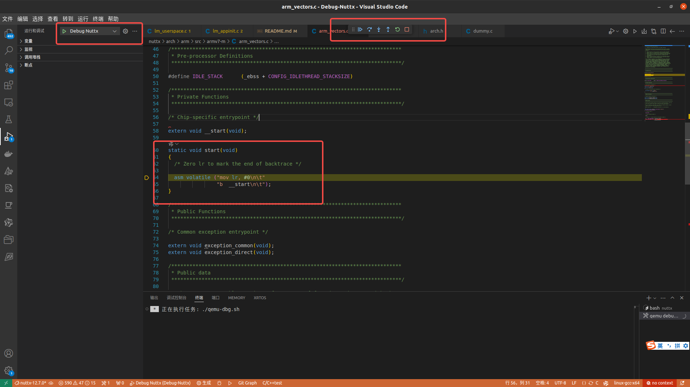

# Debug-Nuttx

# 构建可执行文件
## Make构建
### 配置开发板(lm3s6965)
```
./tools/configure.sh lm3s6965-ek:qemu-flat
```
### 编译
```
make -j12
```
### 编译结果


## CMake构建
CMake构建qemu类型的配置有问题，暂时只能使用make生成的调试

### 配置开发板(lm3s6965)
首先到nuttx目录下执行配置命令
```
cmake -B build -DBOARD_CONFIG=lm3s6965-ek:nsh
```
### menuconfig
```
cmake --build build -t menuconfig
```
### 构建
```
cmake --build build
```
### make
```
make -j12
```


# 调试界面
点击vscode的调试按钮，进入调试界面，断点停止在程序的入口点，接下来可以愉快的进行调试了。


### 配置开发板(armv7-a)
首先到nuttx目录下执行配置命令
```
./tools/configure.sh -l qemu-armv7a:nsh
```
### 编译
```
make -j12
```